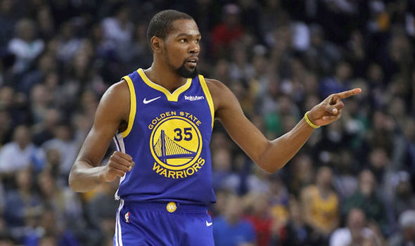

workout01-Yuxuan-Wei
================
Yuxuan Wei

 Why Durant's trade make Goldon State Warriors' offensive play more unstoppable?

 Before Kevin Durant went to GSW, the team has already won a record-setting 73 regular games last season and is believed to be the best team of offensive play in the last 40 years. After Kevin Durant was traded to Warriors, most of the specialists and fans said that the Warriors' offensive play would be even more unstoppable, which did show up in the 2016-17 regular season. So why Durant's joining make the Warriors' offensive play even more historical? 

 When you consider how effective a NBA team's offensive play is, you have to count a huge number of fatcors like schoring rates, assist, turnover and even defense. You also need to count both the starting palyers' and bench players' performance.
In this report, we will use shots data of only five key players in Goldon State Warriors team(Andre Iguodala, Draymond Green,Kevin Durant,Klay Thompson,Stephen Curry) in 2016-17 regular season, and try to get some effects and changes mainly on shots which Durant bring to the Warriors' offensive play.

By analysing the shots data. We first considering the effective shooting percentage of five players for both 2-point and 3-point field goals.

  Effective Shooting % of 2PT and 3PT

|      name      | total | made | prec\_made |
|:--------------:|:-----:|:----:|:----------:|
|  Kevin Durant  |  915  |  495 |  0.5409836 |
| Andre Iguodala |  371  |  192 |  0.5175202 |
|  Klay Thompson |  1220 |  575 |  0.4713115 |
|  Stephen Curry |  1250 |  584 |  0.4672000 |
| Draymond Green |  578  |  245 |  0.4238754 |

 We know that Warriors already has Curry and Thompson who are both the best shoters in the whole league. So how about Durant? As we can seen from the table, Durant is nearly the most reliable shoter as the third place of total number of shots and first place of the shots-made rate among all these five key players of the Warriors team. There is no doubt that Durant is one of the best shoter in the league all the time. He is as good as Curry, who is considered to be one of the best shoter in the NBA history. This means Warriors don't need to only rely on Curry or Thompson for shoting and scoring anymore and has another good choice as Durant.When one team has three best shoters of the league on the court, no team can easily stop them socring.

Besides the total shots-made rate, let's look more closely on the 2-point and 3-point field goals respectively. 

 Effective Shooting % of 2PT

|      name      | total | made | prec\_made |
|:--------------:|:-----:|:----:|:----------:|
| Andre Iguodala |  210  |  134 |  0.6380952 |
|  Kevin Durant  |  643  |  390 |  0.6065319 |
|  Stephen Curry |  563  |  304 |  0.5399645 |
|  Klay Thompson |  640  |  329 |  0.5140625 |
| Draymond Green |  346  |  171 |  0.4942197 |

 Effective Shooting % of 3PT

|      name      | total | made | prec\_made |
|:--------------:|:-----:|:----:|:----------:|
|  Klay Thompson |  580  |  246 |  0.4241379 |
|  Stephen Curry |  687  |  280 |  0.4075691 |
|  Kevin Durant  |  272  |  105 |  0.3860294 |
| Andre Iguodala |  161  |  58  |  0.3602484 |
| Draymond Green |  232  |  74  |  0.3189655 |

 Warriors already has some good 3PT goals shoters, but the team's 2PT shots are not as good as 3PT shots before Durant's trade. So what happened after Durant joined the team? When comparing these two table, we find a interesting fact that Durant shot more 2PT goals than others and made more 2PT goals than others with more than 60% hit rate, while he only get less than 40% rate for a small number of 3PT goals. On the contrary, Thompson and Curry are the first two place of number for 3PT shots and hit rate(both more than 40%), while they don't get a large number shots and high rate of 2PT goal like Durant. We can see that Durant and Curry with Thompson are complement in offensive play while Durant is better on 2PT shots and Curry with Thompson are better on 3PT shots. So when Durant focuses on 2PT shots and Curry with Thompson focus on 3PT shots, coach Steve Kerr can have multiple tactics when these players play togrther in the same team due to the comprehensiveness of the team. And the coach of opponent team will find it hard to choose a appropriate defense strategy when playing against Warriors.

Besides the hit rate and types of shot, What else can Durant do? Well, if you look at all the five key players' shot charts together as follows: 

 Shot Charts for Five Key Players of Warriors(2016-17 regular season)  

 You will notice that Durant's shot chart has the most dispersive distribution compared to other four players' chart. Durant can make shots on every corner of the court, which means he don't have any preference or special need for the position when making a shot and score. As is shown in the chart, he can shoot and score at any position and get the nearly same high hit rate at different position. His property not only help he to join the team's offensive play quickly, but more important, makes his teammate plays more comfortable and effecient on the count. Durant can change the position for shots according who he is play with and give chance to his teammate to make shots on their most confident position. Then the whole team's offensive play will be more effective.

After considering the effect of Durant on Warriors' offensive play, we also need to consider the influence of Warriors on Durant's own offensive play.

Before joined the Warriors,Durent has already been considered as one of the best players in the league. He has to make a lot of shots and face huge defense pressure every night on the count since most of the time, the whole team is count on him own. But things changed after he joined the Warriors. According to the above table, Durant make less number of shots then he used to make in the previous season(according to the from <https://www.nba.com/players/kevin/durant/>) which means he is less tired since he has many teammates like Curry,Thompson, Iguodala and Green to rely on. He plays less minutes on the count than precious season(according to the from <https://www.nba.com/players/kevin/durant/>) and become more energetic, which helps him to raise his hit rate.What's more,when facing teams with really good defense, Curry and Thompson will attract the defense attention from their opponent team, which makes him face less defense pressure than usual, he can score easily. The Warriors team is making Durant to score more effective and comfortable.

Overall, the Durant's trade is not just a simple trade that adds another star into a team which full of stars. And the whole league know that Warriors has the best offensive play due to their teamwork rather than let stars play on their own. What Durant actually bring to the Warriors' offensive play is as follows:
1.Warriors gets another reliable shoter with high hit rate.
2.Warriors gets a player who is good at 2PT field goals, which help them to enrich their offensive play tactics.
3.Warriors gets a player who can score at any position and make other teammate more effecient.

Everyone now would say, Durant's trade is a fantastic trade for the Warriors.

